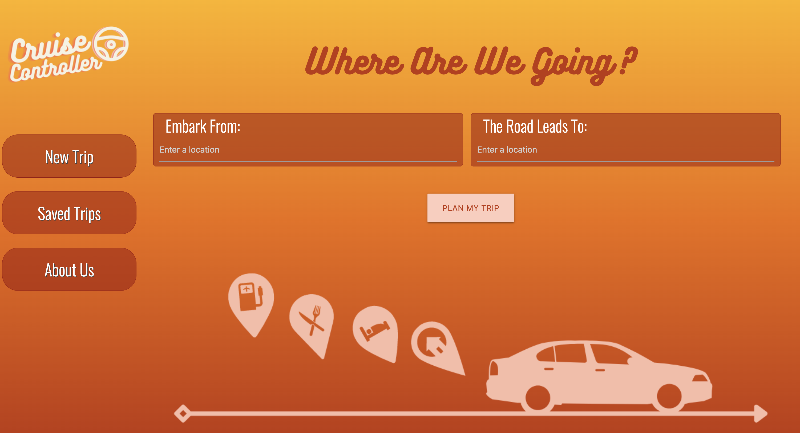

# Cruise Controller - Passenger Party 

## Description
Road trip itinerary with distance to travel, time to travel, the weather in your destinations, a list of  top places to stay and restaurants to try in your destination. The site also allows the user to save their trip search to a separate page, and return to the trip details. 

## User Story 
As a hardworking person who deserves a vacation,  I want to plan a road trip.

I want a snapshot of what my road trip will look like on the map, and how long the trip will take.

I want to know what the weather is like in my destination.

I want to see a list of hotels to stay in, and a list of restaurants to try.

I want the option to save my search, and return to my search from a list of saved trips. 

## Technology Used 
For this project we used Materialize CSS for our styling, and Google Fonts for the font used. We also used the Google Maps API to append our road trip map to our trip page. The Open Weather API is used to display the weather in the destination city. The Yelp API provides information about hotels, and restaurants to visit in the destination city.  

## Overview 

[Link to Deployed Page](https://passenger-party.github.io/Cruise-Controller/trip.html)

[Link to Repo](https://github.com/Passenger-Party/Cruise-Controller)

## Summary 
 - Used CSS to create a responsive design depending on the users screen size
 - Applied input from the home page to create the route on the Google Map, as well as calculate the distance of the trip, and time it will take to drive to the destination
 - Placed user input in local storage, to pull the weather data, Yelp information for the destination city. The user information saved to local storage also allows the trip to save to the "Saved Trips" pages

## Authors 
[Clare Bryar](https://github.com/clarebryar)

[Elena Fadeeva](https://github.com/elenafwork)

[North Goddard](https://github.com/northgoddard)

[Daniel Wittig](https://github.com/deegeedubs)
